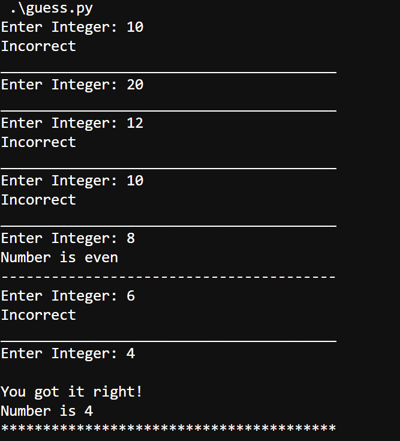

## Guessing Game
This is a simple guessing game where the user has a limited number of attempts to guess the correct integer number. Hints are given.

## Hints
- If the number is greater than 15 or less than 15.
- If the number is odd or even.

## Example of game

     
## Additional info
- Uses the random module
- While loop using inputs for user to guess number
- Uses dictionary and conditional statements
- 44 lines of code
- Saved as a Python script
